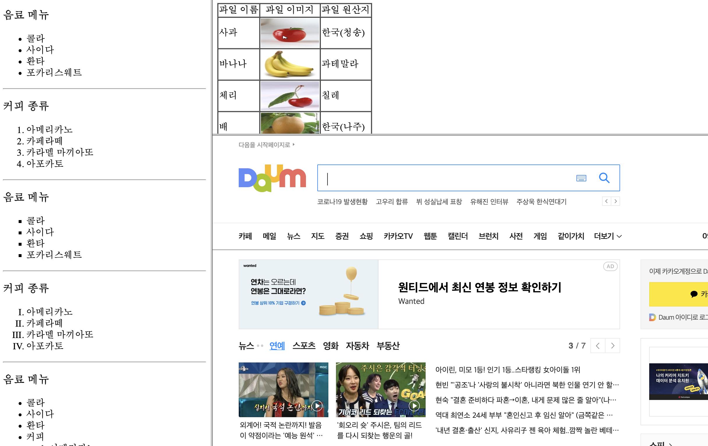

## HTML TAG

- 블록레벨 요소

  - 주요 태그 : hn, p, div
  - 구역이 한줄, 전체 영역으로 설정
  - 사용 가능한 최대 가로 너비로 사용한다.
  - width:100%, height:0%로 시작 (default)
  - 크기를 지정할 수 있음.
  - 수직으로 쌓인다.
  - margin, padding의 속성에
    위, 아래, 좌, 우 사용이 가능함.
  - 주로 레이아웃을 설정하는 용도록 사용이 됨.

- 인라인레벨 요소
  - 주요 태그 : span, img
  - 구역이 단어나 문자의 글자까지만 설정
  - 필요한 만큼의 너비를 사용한다.
  - width:0%, height:0%로 시작
  - 크기를 지정할 수 없음.
  - 수평으로 쌓임.
  - margin, padding의 속성에
    위, 아래, 좌, 우 사용이 불가능함.
- 텍스트를 설정하는 용도로 사용이 됨.

* 단독태그 : 끝태그가 없는것
* 태그는 속성을 줄 수 있다.
  - 위치 : 시작태그안에 속성값 지정

| 태그           | 사용                                                            | 설명                                                                      |
| -------------- | --------------------------------------------------------------- | ------------------------------------------------------------------------- |
| hn             | &lt;hn&gt;&lt;/hn&gt;                                           | n은 숫자를 나타내며 1~6까지 사용 가능(숫자가 클수록 중요도 ↓)             |
| p              | &lt;p&gt;&lt;/p&gt;                                             | 문단을 만드는 태그, 블록레벨                                              |
| font           | &lt;font size="n"&gt; &lt;/font&gt;                             | n은 숫자를 나타내며 숫자가 클수록 글씨 크기가 커진다. size 속성 작성 필수 |
| a              | &lt;a href="#"&gt;&lt;/a&gt;                                    | 페이지, 파일, 메일주소로 이동 할 수 있는 하이퍼링크 태그                  |
| ul li          | &lt;ul&gt;&lt;li&gt;&lt;/li&gt;&lt;/ul&gt;                      | unlordered list : 순서가 없는(정렬되지 않은) 태그                         |
| ol li          | &lt;ol&lt;li&gt;&lt;/li&gt;&lt;/ol&gt;                          | ordered list : 순서가 있는(정렬된) 태그                                   |
| dl dt dd       | &lt;dl&gt;&lt;dt&gt;&lt;/dt&gt;&lt;dd&gt;&lt;/dd&gt;&lt;/dl&gt; | 용어 정의, 설명 태그                                                      |
| img            | &lt;img src="이미지경로.파일명" alt="" &gt;                     | 이미지 태그, 단독태그                                                     |
| audio          | &lt;audio src="파일경로.파일명"&gt;&lt;/audio&gt;               | 오디오 태그                                                               |
| video          | &lt;video src="비디오 경로"&gt;&lt;/video&gt;                   | 비디오 태그                                                               |
| iframe         | &lt;iframe src="파일경로.파일명" ...&gt;&lt;/iframe&gt;         | 내부프레임, 하나의 html 문서에 다른 html 문서를 보여주고 싶을때           |
| frameset frame | &lt;frameset&gt;&lt;frame&gt;&lt;/frame&gt;&lt;/frameset&gt;    | 여러개의 html 문서를 동시에 한 화면에 나타나게 할 수 있는 태그            |
| table          | &lt;tabel&gt;&lt;/table&gt;                                     | 표를 만들어주는 태그 <br>[링크참고]()                                     |
| form           | &lt;form&gt;&lt;/form&gt;                                       | 사용자로부터 정보를 받을때 사용하는 태그 <br>[링크참고]()                 |
| mark	|&lt;mark&gt;&lt;/mark&gt;    	| 형광펜 태그	|
| br             | &lt;br&gt;                                                      | 줄바꿈, 단독태그                                                          |
| hr             | &lt;hr&gt;                                                      | 라인, 단독태그                                                            |
| div            | &lt;div&gt; &lt;/div&gt;                                        | 태그들을 묶을때 사용(width,height크기지정 가능)                           |
| span           | &lt;span&gt;&lt;/span&gt;                                       | 태그들을 묶을때 사용(인라인속성:width,height크기지정 불가능)              |

## 텍스트 서식 태그

- text 서식관련 태그

  | 태그  | 설명                                      |
  | ----- | ----------------------------------------- |
  | b     | 텍스트 글자 굵은 글자로 만들어주는 태그   |
  | i     | 기울림체                                  |
  | small | 텍스트 글자를 작은 글자로 만들어주는 태그 |
  | sub   | 텍스트 글자를 아랫첨자로 만들어주는 태그  |
  | sup   | 텍스트 글자를 윗첨자로 만들어주는 태그    |
  | ins   | 텍스트 글자를 밑줄                        |
  | del   | 취소문자                                  |

    <p> 이것은 <b> 볼드체 </b> </p>
    <p> 이것은 <i> 기울림체 </i> </p>
    <p> 이것은 <small> 작은 글씨체 </small> </p>
    <p> H <sub> 2</sub> O</p>
    <p> (x+y) <sup> 2</sup> </p>
    <p> 글자 아래 <ins> 밑줄 </ins> </p>
    <p> 글자  <del> 취소 </del> </p>

## 속성

- width : 가로길이
- height : 세로길이
- aline : 정렬

### - hn

- aline : 정렬

```
 <h2 align="center"> 제목태그 2 입니다. </h2>
```

### - hr

### - a

- target : 페이지 이동 타겟

  - _self : 현재 창에서 특정 페이지로 이동한는 속성(default)
    _ \_blank : 새로운창에서 특정 페이지로 이동 (기존창은 유지되고 새창이 열린다. )
  - 사용 예시

  ```
  <!-- 특정 홈페이지로 이동 + 링크클릭시 기존 페이지 유지 새로운창 오픈 -->
  <a href="https://www.wavve.com/" target = "_blank">웨이브</a> <br/>

  <!-- 특정 html 페이지로 이동  -->
  <a href="Ex03_p_br.html" target = "_blank">특정 html 파일로 이동</a> <br/>

  <!-- email 계정 연결 : outlook 계정 이용자만 사용 가능 -->
  <a href="hye0ah0@gmail.com" target = "_blank">내 메일 주소로 이동</a> <br/>

  <!-- 파일여는 방법 -->
  <a href="images/apple.jpg" target = "_blank">이미지파일 열기</a> <br/>

  <!-- 의미없는 링크 : 아무곳도 안 넘어가도록하기위함 -->
  <a href="#">href = #</a>

  ```

### - font

- size
- color
- face : 폰트

```
 <font size ="3" color="pink" face = "AppleGothic"> font 태그 3</font><br/>
```

[맥 폰트](https://support.apple.com/en-us/HT208968)

### - ul/ol

- ul

  - type
    - disc : 기본 값 채워진 동그라미
    - circle : 빈동그라미
    - square : 사각형

- 예시
  <ul type = "disc">
  <li> disc </li>
  </ul>
  <ul type = "circle">
  <li> circle </li>
  </ul>
  <ul type = "square">
  <li> square </li>
</ul>

- ol

  - type
    - 1 : 기본값 1부터
    - a : a부터
    - A : A부터
    - i : 로마숫자 i부터(소문자)
    - I : 로마숫자 I부터(대문자)

- 예시
  <ol>
    <li>아메리카노</li>
    <li>카페라떼</li>
    <li>카푸치노</li>
    <li>바닐라라떼</li>
  </ol>
  <ol type="a">
    <li>아메리카노</li>
    <li>카페라떼</li>
    <li>카푸치노</li>
  </ol>
  <ol type="A">
    <li>아메리카노</li>
    <li>카페라떼</li>
    <li>카푸치노</li>
  </ol>
  <ol type="i">
    <li>아메리카노</li>
    <li>카페라떼</li>
    <li>카푸치노</li>
  </ol>
  <ol type="I">
    <li>아메리카노</li>
    <li>카페라떼</li>
    <li>카푸치노</li>
  </ol>

### - dl/dt/dd

- 예시

  <dl>
      <dt>사과</dt>
      <dd>사과나무의 열매</dd>
      <dt>바나나</dt>
      <dd>파초과의 상록 여러해살이풀</dd>
  </dl>

### - img

- src : 이미지경로(파일주소)
- alt : 이미지가 잘못되었을때 화면에 보이는 텍스트
- title : 이미지 위에 마우스를 올렸을때 나타나는 텍스트
- width : 이미지 가로 크기
- height : 이미지 세로크기

  

### - audio/video

- src
- controls : 플레이, 정지, 볼륨 조절할 수 있다.
- autoplay : 자동 재생
- loop : 무한 재생
- poster="이미지주소.파일명" : video 속성 / 영상이 나오기 전 포스터가 먼저 보여진다. 포스터를 클릭하면 영상이 보여진다.

<video src="audio/cloud.mp4"
		   poster="audio/rose.jpg" 
       controls autoplay loop></video>

### - iframe

- src : 파일경로
- width : 가로
- height : 높이
- scrolling : 스크롤바 유무(yes, no, auto)
- frameborder : 테두리 표시(1:테두리o, 0:테두리x)

  <iframe src="test.html" width="70%" height="80%" scrolling=yes frameborder=1></iframe>

### - frameset / frame

  

- &lt;/head&gt; head 가 끝나고 &lt;body&gt; body가 시작되기 전에 작성한다.

- frameset

  - cols : 수직으로 나누고자 하는 프레임을 픽셀이나 비율을 이용하여 순서대로 지정
  - rows : 수평으로 나누고자 하는 프레임을 픽셀이나 비율을 이용하여 순서대로 지정
  - frameborder : 프레임을 나누는 경계선의 두께를 지정한다. 0으로 지정시 경계선이 보이지 않는다.

- frame

  - src : 해당 프레임에서 보여줄 문서의 경로와 파일 이름을 지정
  - name : 프레임 이름을 지정할때 사용, 링크연결시 target 대상
  - scrolling : 스크롤바가 보여지게 할지 여부 (yes,no,auto)

- 예시

```
<!-- 왼쪽 30% , * = 나머지 -->
<frameset cols="30%, *" >
  <frame src="Ex10_ul_ol.html">
  <frameset rows="50%,*">
    <frame src="Ex14_table_img.html">
    <frame src="http://www.daum.net">
  </frameset>
</frameset>
```
